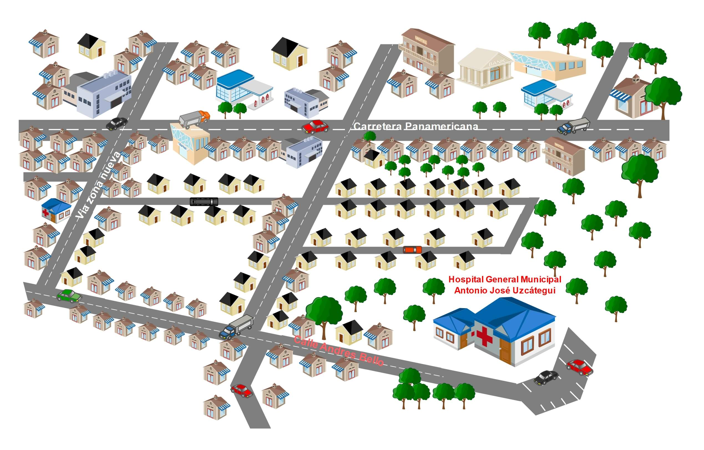
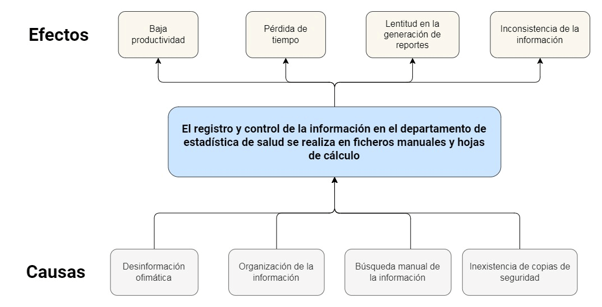

<header style="display: grid; grid-template-columns: 1fr 1fr">
  
  
</header>

## Implementar un Sistema Automatizado para el Registro y Control del Departamento de Estadistica de Salud del Hospital Antonio José Uzcátegui

<table>
  <tr>
    <th>Tutor/es académicos</th>
    <th>Autores</th>
    <th></th>
  </tr>
  <tr>
    <td>Ing. Elsa Fandiño</td>
    <td>Daniel Mancilla</td>
    <td>C.I. 27.668.711</td>
  </tr>
  <tr>
    <td>Ing. Francisco Berrios</td>
    <td>Eliliana Marín</td>
    <td>C.I. 27.551.661</td>
  </tr>
  <tr>
    <td>Ing. Emerson Navarro</td>
    <td>Franyer Sánchez</td>
    <td>C.I. 28.072.391</td>
  </tr>
  <tr>
    <td></td>
    <td>Jenifer Lázaro</td>
    <td>C.I. 29.794.519</td>
  </tr>
</table>

## Índice

- **[Introducción](#introducción)**
- **[Capítulo I: Identificación de la comunidad](#capítulo-i-identificación-de-la-comunidad)**
  - [Nombre de la comunidad](#nombre-de-la-comunidad)
  - [Ubicación de la comunidad](#ubicación-de-la-comunidad)
  - [Misión](#misión)
  - [Visión](#visión)
  - **[Planteamiento del problema](#planteamiento-del-problema)**
  - [Objetivos del proyecto](#objetivos-del-proyecto)
    - [Objetivo general](#objetivo-general)
    - [Objetivos específicos](#objetivos-específicos)
  - [Delimitación del proyecto](#delimitación-del-proyecto)
  - [Justificación del proyecto](#justificación-del-proyecto)
- **[Capítulo II](#capítulo-ii)**
- **[Capítulo III](#capítulo-iii)**
- **[Capítulo IV](#capítulo-iv)**
- **[Anexos](#anexos)**

## Introducción

## Capítulo I: Identificación de la comunidad

### Nombre de la comunidad

Hospital General Municipal Antonio José Uzcátegui **(HAJU)**.

### Ubicación de la comunidad

Estado Mérida, Municipio Caracciolo Parra y Olmedo, Parroquia Tucaní, Sector Andrés Bello, calle principal.

<figure>
  
  <figcaption>
    <b>
      Figura 1. Croquis de ubicación del hospital Antonio José Uzcategui.
    </b>
    <small>
      Fuente: Sánchez, Mancilla, Marín y Lázaro (2023).
    </small>
  </figcaption>
</figure>

### Misión

El Departamento de Registros y Estadísticas de Salud, tiene el propósito de asegurar, mantener, producir, interpretar, preservar y garantizar la información de los registros asistenciales derivados de la atención prestada al usuario a través  del análisis cuantitativo y cualitativo de los problemas de la salud de la comunidad.

### Visión

Garantizar en forma idónea el sistema de información estadísticas optimalizada el procesamiento de los registros asistenciales que puedan permitir el estudio cuantitativo y cualitativo de los problemas de la comunidad.

### Planteamiento del problema

El mundo actual se destaca por estar en la era de la tecnología comunicacional e informática, los datos y la información digital hoy tienen mucho valor, el comercio, la educación y la salud son solo algunas de las múltiples áreas en las que se desarrollan las tecnologías de información y comunicación. Es importante confrontar el desarrollo que se ha llevado a cabo en el campo de la informática. Es posible enfatizar, que las computadoras han liberado a las personas de labores manuales usando la informática como recurso de efectividad. Por otra parte, en la actualidad los Sistemas Automatizados, han sido implementados en instituciones, organizaciones, empresas u oficinas públicas o privadas, con el fin de agilizar, mejorar el trabajo y lograr que sean más seguros los procesos que se realizan generando menos costos.

El Hospital General Municipal de Tucaní Antonio José Uzcátegui cuenta con un departamento de estadística de salud, donde se llevan los reportes de los pacientes que acuden al hospital, ofreciendo la información por mes de todos los registros que se llevan por departamento, sin embargo, este proceso se lleva manualmente mediante libros de hojas del cálculo............

El proceso de registro y control de la información almacenada en los archivos en el área de estadística, tanto digital como en físico, se vuelve tedioso al momento de hacer ....... o reportes, ya que es mucha la información almacenada. Considerando que los registros son manuales en libros de Excel, esto genera un proceso lento en la búsqueda de información, pérdida de tiempo, incongruencia de datos, perdida de información al no existir un respaldo de los mismos y mayor recurso humano.

Por ende, realizar un sistema automatizado de registro y control, es la solución propuesta para HAJU, el cual debe cubrir las necesidades principales como lo son: llevar un ......., seguridad de datos, detallar los procesos de gestión de cada nuevo registro, ahorrar tiempo y recurso humano, registro detallado de los pacientes, También se considera que este sistema tenga características flexibles, para que los usuarios finales se adaten fácilmente al sistema sin ningún inconveniente o problema teniendo en cuenta los estándares de calidad.

### Objetivos del Proyecto

#### Objetivo general

Implementar un sistema automatizado para el registro y control del departamento de estadistica de salud del Hospital Antonio José Uzcátegui.

#### Objetivos específicos

* Diagnosticar la situación actual del Departamento de Estadística y ....... las necesidades que debe cubrir el sistema en base a la comunidad misma.

* Analizar los diferentes datos que maneja el Departamento de Estadística, los procesos y sus variantes que pueden ocurrir en los registros de los departamentos, así como la posibilidad de corrección de datos mal ingresados para poder generar un esquema claro de lo que va hacer el sistema.

* Diseñar un sistema automatizado en base a lo diagnosticado y analizado previamente de la comunidad y que este cumpla con los estándares de calidad, interfaz agradable para el usuario final y lo más importante que solvente la problemática de la comunidad.

* Instruir sobre el uso del sistema automatizado al personal administrativo y aquellos usuarios laborales que interactúen con el sistema para que obtengan una mejor experiencia con el sistema.

* Implementar el sistema automatizado en HAJU, asegurando el correcto funcionamiento del mismo en cada ordenador de la comunidad.

### Delimitación del proyecto

El proyecto se realizará en el Departamento de Estadística del Hospital General Municipal Antonio José Uzcátegui ubicado en el Municipio Caracciolo Parra y Olmedo, en la parroquia Tucaní, sector Andrés Bello, el cual se estima que tendrá una duración de un año para ser efectuado y aplicado. El proyecto se basará en un sistema automatizado para el registro y control de la información ........... El sistema estará realizado en base a los lenguajes PHP y JavaScript, con apoyo del Wampserver para base de datos, y el editor de código Sublime Text.

### Justificación del proyecto

Hoy en día, los sistemas de información proporcionan la comunicación y el poder de análisis que muchas instituciones requieren para llevar a cabo el control y la administración que facilita el proceso de la toma de decisiones y el procedimiento de datos organizado de manera rápida y eficiente.

En este sentido, el sistema automatizado propuesto para el registro y control del departamento de estadística de salud del HAJU facilitará el flujo de información y el manejo el manejo de datos estadísticos con precisión, eficacia y facilidad.

Con la implementación del sistema automatizado se puede tener un control sobre toda la información referente al departamento de estadística, para que puedan llevar un registro automatizado de todas las incidencias que se presentan dentro del recinto hospitalario y que a su vez les permita ahorrar papelería, optimizar el tiempo de respuesta, mejora la calidad de vida de las personas que realizan estos procesos, ya que una vez ingresada la información al sistema automatizado, este será capaz de generar los reportes correspondientes.

## Capítulo II

### Antecedentes Teóricos y Tecnológicos

Casella y Monteverde (2018). Sistema de información orientado a la web que centralice los datos de las sedes regionales en el departamento de Donaciones y Estadísticas. Caso: Fundación amigos del niño con Cáncer (Venezuela). Universidad Nueva Esparta. el objetivo que plantea la investigación mencionada es desarrollar un sistema automatizado que centralice la información en el departamento de donaciones y Estadísticas originada de las sedes Regionales de la Fundación, para dar solución a la problemática que le permita a la Fundación Amigos del Niño con Cáncer el control y acceso oportuno de las estadísticas que se generan. Utilizaron como herramienta el marco lógico con la finalidad de agilizar el proceso estadístico adaptándose a una investigación de tipo documental y de campo logrando resultados satisfactorios en la implementación del sistema.

Dicho antecedente aporta a la presente investigación una solución de la problemática que se presenta desarrollando un sistema que permita el control y acceso de las estadísticas que se generan, y así facilitar el proceso para el control de los servicios del departamento de estadísticas de salud del Hospital “José Antonio Uzcategui”.

<mark>De Freitas (2020). “Desarrollo de una aplicación web para la gestión estadística _(control de las actividades de los analistas)_ de la gerencia soporte de negocio”. Caso: Banesco, Banco Universal C.A. El objetivo de esta investigación en base al sistema de gestión de estadísticas y control de las actividades de los analistas, destacándose como problema principal, falla en los reportes estadísticos y respuestas tardías. De acuerdo a esta problemática se planteo desarrollar e implementar un sistema automatizado para la gestión estadística aplicando la metodología RUP (Rational Unified Process) y que se determina como proyecto factible este tipo de investigación, adaptándose a un tipo de diseño documental y de campo.</mark>

La investigación antes mencionada, forma parte como base de conocimiento para el desarrollo de la investigación en curso, ya que uno de los objetivos principales es automatizar las actividades para el control, gestión y estadísticas de los servicios del Departamento de Estadísticas de Salud del Hospital “José Antonio Uzcátegui”.

Torres (2020). “Sistema de información automatizado para el control de variables de la calidad del proceso productivo de la empresa laboratorios VALMOR C.A. Universidad Nacional Abierta. Mérida”. El objetivo de esta investigación es desarrollar un sistema para automatizar la información suministrada por la empresa Laboratorios VALMOR C.A con la finalidad de mantener el control de calidad en la elaboración de los medicamentos. Este sistema está orientado a la generación de reportes y estadísticas que suministra información rápida y veraz al departamento de Gerencia de Control de Calidad para que de esta manera se puedan observar los cambios y tendencias de cada una de las variables objeto de control y a la toma de decisiones. Se utilizo la metodología RUP facilitando y orientado el seguimiento de las pautas de dicha metodología, empleando el diseño de investigación documental a nivel exploratorio, descriptivo y explicativo, obteniendo resultados exitosos en la realización de los procesos estadísticos con el sistema automatizado de la mencionada empresa.

Así mismo esta investigación está relacionada debido a que su desarrollo optimiza los procesos de gestión de la información, con la finalidad de disminuir y eliminar las dificultades y pérdidas que puedan generar un sistema gestionado de forma manual. Como lo ha llevado hasta los momentos el personal del Hospital “José Antonio Uzcátegui”.

### Bases Teóricas

#### Sistemas de información

Según Laudon J (1995), en su libro de Administración de los Sistemas de Información definen un Sistema de Información de la siguiente manera:
“Un Sistema de Información puede definirse técnicamente como un conjunto de componentes interrelacionados que permiten capturar, procesar, almacenar y distribuir la información para apoyar toma de decisiones y el control en una institución. Además, para apoyar la coordinación. Los Sistemas de Información pueden también ayudar a los administradores y al personal a analizar problemas, visualizar cuestiones complejas y crear nuevos productos. (p.08).”

#### Interfaz Gráfica de Usuario (GUI)

Es el medio con que el usuario puede comunicarse con una máquina y comprende todos los puntos de contacto entre el usuario y el equipo, normalmente suelen ser fáciles de entender y fáciles de accionar.

#### Organización

Es un sistema de actividades conscientemente coordinadas formado por dos o más personas; la cooperación entre ellas es esencial para la existencia de la organización. De igual forma, Para Andrade S (1993), la organización es "la acción y el efecto de articular, disponer y hacer operativos un conjunto de medios, factores o elementos para la consecución de un fin concreto". En este sentido, Una organización solo existe cuando hay personas capaces de comunicarse y que están dispuestas a actuar conjuntamente para obtener un objetivo común.

#### Seguridad

Puede entenderse como aquellas reglas técnicas y actividades destinadas a prevenir, proteger y resguardar lo que es considerado como susceptible de robo, pérdida o daño, ya sea de manera personal, grupal o empresarial. De igual forma, cotidianamente se puede referir a la ausencia de riesgo o a la confianza en algo o en alguien. En este sentido, según Wolfers (1962), define la seguridad como: “la ausencia de amenazas a los valores adquiridos; en el sentido subjetivo, la ausencia de miedo a que dichos valores pudieran destruirse”. Estar seguro sería, pues, encontrarse libre de miedos y, a la vez, libre de necesidades.  En tal sentido, es la información el elemento principal a proteger, resguardar y recuperar dentro de las redes empresariales. Garantizando que los recursos informáticos de una compañía estén disponibles para cumplir sus propósitos, es decir, que no estén dañados o alterados por circunstancias o factores externos.

#### Registro

Es la acción que se refiere a almacenar algo o a dejar constancia de ello en algún tipo de documento. Está vinculada a consignar determinadas informaciones en un soporte. El registro de datos puede desarrollarse tanto en un papel como en formato digital.

#### RUP

El proceso Unificado de Rational (RUP) define las 4 fases de un proyecto: principio, elaboración, construcción y transición. También se pueden utilizar fases de definición, diseño, desarrollo y entrega. Esto busca la realización de un ciclo de vida de un proyecto de software para poder garantizar su creación de manera correcta y eficiente.

Según Canós, José H., y María Carmen Panadés Patricio Letelier. “Metodologías ágiles de software” (2012).

#### EML

Es una herramienta analítica para la planificación de la gestión de proyectos orientas por objetivos. Esta mitología utiliza el análisis de los involucrados, análisis de los problemas, análisis de los objetivos, análisis de alternativas y matriz de marco lógico.

Según Ortegón et al. (2005), el marco lógico es una metodología que facilita los procesos de conceptualización, diseño y evaluación de proyectos; está centrada en la orientación por objetivos y grupos beneficiarios, para facilitar la participación y comunicación en tres partes interesadas.

### BASES TECNOLÓGICAS

#### Ordenador

Según Garrido (2006, p. 2) un computador “es una máquina diseñada para aceptar un conjunto de datos de entrada, procesarlos y obtener como resultado un conjunto de datos de salida.” Paralelamente Guevara (2006, p. 1) un computador, ''es un dispositivo electrónico capaz de “procesar información”.

#### Base de datos

Según (Gómez, 2007, p. 18) una base de datos es un conjunto de datos que pertenecen al mismo contexto, almacenados sistemáticamente para su posterior uso, es una colección de datos estructurados según un modelo que refleje las relaciones y restricciones existentes en el mundo real.

#### Código fuente

#### PHP

(PHP Hypertext Pre-processor). Lenguaje de programación usado generalmente en la creación de contenidos para sitios web. Es un lenguaje interpretado especialmente usado para crear contenido dinámico web y aplicaciones para servidores, aunque también es posible crear aplicaciones gráficas utilizando la biblioteca GTK+.

Generalmente los scripts en PHP se incrustan en otros códigos como HTML, ampliando las posibilidades del diseñador de páginas web enormemente.

La interpretación y ejecución de los scripts PHP se hacen en el servidor. El cliente (un navegador que pide una página web) sólo recibe el resultado de la ejecución y jamás ve el código PHP.

#### Lenguaje Unificado de Modelado (UML)

El lenguaje de modelado unificado (UML) es un estándar para la representación visual de objetos, estados y procesos dentro de un sistema. Por un lado, el lenguaje de modelado puede servir de esquema para un proyecto y garantizar así una arquitectura de información estructurada; por otro lado, ayuda a los desarrolladores a presentar la descripción del sistema de una manera que sea comprensible para quienes están fuera del campo. UML se utiliza principalmente en el desarrollo de software orientado a objetos. Al ampliar el estándar en la versión 2.0, también es adecuado para visualizar procesos empresariales.

#### MySQL

MySQL es el nombre de un sistema que permite la gestión de bases de datos. Se trata de la opción más utilizada para aplicaciones que se basan en la Web.

Este administrador relacional de bases de datos fue creado por la compañía MySQL AB. Dicha empresa fue comprada por Sun Microsystems en 2008, que a su vez fue adquirida por Oracle Corporation dos años más tarde. Esto quiere decir que hoy en día Oracle dispone de los derechos de la mayor parte del código, aunque MySQL presenta una licencia doble (cuenta con una licencia comercial en manos de Oracle y otra licencia pública general).

La base de datos de MySQL, por lo tanto, se distribuye de distintas maneras. Hay una versión con licencia pública general de GNU (la denominada Community Edition) y otras orientadas a empresas que brindan servicios y productos adicionales. Cabe destacar que Facebook, YouTube y Twitter, entre otros de los sitios web más visitados del mundo, trabajan con MySQL.

GNU/Linux, Mac OS X, SunOS, Solaris y diferentes versiones de Windows (Windows 7, Windows 10, Windows Vista y otras), entre muchas plataformas más, permiten el funcionamiento de MySQL.

#### SQLite

Se considera una biblioteca que se encuentra en constante proceso y que implementa un motor de base de datos SQL, el cual se caracteriza por ser transaccional, no contar con un servidor y no necesitar una instalación previa para poder usarlo.

## Capítulo III

Las metodologías aplicadas para el proyecto HAJU son la de “Marco Lógico” y “Proceso Racional Unificado”, las cuales son efectivas con el desarrollo del proyecto, ya que la realización del mismo consta de una duración de un año, son adaptables a las organizaciones o requisitos de los usuarios, permite detallar los problemas, objetivos y alternativas en las soluciones para el diseño del sistema automatizado. Con estos métodos, se realizó una planificación de un año, en la cual se estudió la problemática y en base a la misma se busco las soluciones y alternativas congruentes para el departamento de estadísticas de HAJU, la cual consta del desarrollo de un sistema automatizado siguiendo las etapas de la metodología RUP.

La metodología del marco lógico consta de 4 etapas y una matriz, de las cuales las actividades realizadas de cada etapa son el análisis de los involucrados los cuales refieren a: estudiantes de la UPTM, el director administrador del hospital, el análisis de los problemas ya se han determinado, el análisis de los objetivos en las cuales los mismos ya han sido establecidos y de igual manera el análisis de las alternativas para lograr una buena adaptación de la solución a la problemática presentada.

Por otro lado, en la metodología RUP, cual consta de 4 etapas para el desarrollo del sistema automatizado, la primera “fase de inicio”, la segunda “fase de elaboración” y la tercera “fase de construcción”. Se han hecho el análisis de requisitos, los diagramas UML y análisis preliminares; la tercera “fase de elaboración” es la construcción del sistema automatizado.

### Tipo y Diseño de Investigación

La investigación sobre el departamento de estadísticas de HAJU se ha logrado abarcar bien empleando las metodologías RUP y el Marco lógico, dado que con la metodología del marco lógico se permite planificar, monitorear y evaluar el proyecto de desarrollo del sistema automatizado. Permite establecer los objetivos claramente tomando como referencia el diagnostico, el análisis, el diseño del sistema automatizado, la instrucción e implementación del mismo, establecer indicadores de logro y una estructura para la gestión eficaz del proyecto, asegurando su alineación con las necesidades y metas del departamento de estadísticas de HAJU.

Por otro lado, la metodología RUP permite gestionar el ciclo de vida del software de manera eficiente, asegurando una implementación efectiva y una atención continua a los requisitos del usuario. Además, gracias al enfoque de RUP se permita adaptar a las necesidades cambiantes del entorno del hospital HAJU, lo que hace estructurar el sistema de manera mas eficiente, solidad y eficaz.

Al combinar estas dos metodologías, se destaca un enfoque integral y estructurado en el abordaje del sistema automatizado lo cual es fundamental dada la importancia y la complejidad del entorno hospitalario.

### Población Y Muestra

- **Población**: se refiere a un conjunto de individuos o de objetos sometidos a un estudio estadístico, en el que se considera una o más características. (Gran Diccionario Enciclopédico Visual P. 1285.)

La población y muestra seleccionada para el estudio, es la que trabaja en el departamento de estadísticas de HAJU, se encargan de recolectar información, organizarla, archivarla y enviarla cuando sea necesario, la comunidad cuenta con una administradora, tres (3) secretarias y la directora que posee acceso a la información, de los cuales la administradora y la directora tendrán acceso completo a la información del sistema automatizado.

En este caso la población objeto de estudio son los encargados del departamento de estadísticas en HAJU, ya que se relaciona directamente con la información manejada en el mencionado espacio de estudio, específicamente está constituido por la directora, la administradora y sus secretarias que recolectan la información necesaria sobre la atención brindada por el hospital.

- **Muestra**: es una parte de la población, o sea un número de individuos u objetos seleccionados científicamente cada uno de los cuales es un elemento del universo. (Balestrini, Miriam. 1998. P 216.)

Debido a que la población es finita y pequeña se tomó la misma como muestra para la presente investigación, es decir la muestra es de tipo poblacional. Para este caso 5 personas.

### Técnicas e Instrumentos de Recolección de Datos

Para llevar a cabo el desarrollo de la investigación fue indispensable, poner en práctica procesos que facilitaron la recolección de datos. Arias (1999), menciona que “las técnicas de recolección de datos son las distintas formas de obtener información”. pág.53.

Las técnicas de recolección de datos que fueron utilizadas en la presente investigación son la observación directa y la entrevista.

Según Hernández, Fernández y Baptista (1998), “la observación consiste en el registro sistemático, cálido y confiable de comportamientos o conductas manifiestas”.

La observación se realizó cuando se visitó el hospital HAJU, los objetos de estudio a fin de analizar fueron la metodología de registros, como llevan el manejo de la información y la administración del mismo. En la observación se pudo notar que no poseen un sistema automatizado de registro y control, ya que organizaban la información manualmente en hojas blancas, ficheros manuales y hojas de cálculo de Excel.

En referencia a la entrevista, Márquez (1996), citado por Arias (1999), plantea: “El guion de entrevista es una técnica de recolección de información a partir de un formato previamente elaborado, el cual deberá ser respondido en forma escrita por el informante.

Otras de las técnicas utilizadas para el desarrollo del proyecto fue la entrevista la cual se realizó en forma directa y personal, utilizando como herramienta para la encuesta hoja impresa y lapicero, la misma fue aplicada a 5 personas que fueron la administradora, la directora y las 3 secretarias de estadísticas”.

### Estudio de la Factibilidad

El estudio de la factibilidad se refiere a la disponibilidad de los recursos necesarios para llevar a cabo los objetivos o metas señaladas.

- **Factibilidad técnica**: La factibilidad técnica consiste en determinar inicialmente si para desarrollar un proyecto se requiere de equipos, tecnología y conocimientos o experiencia en un área específica que, puede ser parte de un proceso fundamental o de apoyo como un programa de en específico.

El hospital HAJU cuenta con equipos informáticos y conexión a internet lo cual es necesario como requisitos para la instalación del sistema automatizado, además de que será adaptable para teléfonos, para un manejo cómodo y búsqueda rápida de la información.

Es factible de manera técnica ya que se cuenta con los computadores y programas (Sublime text, rational case, entre otros) para la realización del sistema y los conocimientos necesarios para la elaboración del sistema de registro, para el departamento de estadísticas de HAJU.

- **Factibilidad humana**

Se refiere a que debe existir el personal capacitado requerido para llevar a cabo el proyecto y así mismo, deben existir usuarios finales dispuestos a emplear los productos o servicios generados por el proyecto o sistema desarrollado.

Es factible de manera humana ya que existe el personal necesario para la creación del sistema de Registro y Control, además, hay usuarios finales dispuestos a emplear este sistema de registro y control para el mejoramiento en eficacia y eficiencia en lo que respecta al departamento de estadísticas de HAJU.

Dado la inspección y análisis de la factibilidad técnica y humana el sistema de registro y control es factible por las siguientes razones: se cuenta con los programas necesarios para su realización; también se cuenta con la ayuda humana necesaria para la realización de este, junto con usuarios que requieren de este sistema.

## Capítulo IV

## Anexos

<figure>
  
  <figcaption>
    <b>
      Figura n. Árbol del Problema
    </b>
    <small>
      Fuente: Sánchez, Mancilla, Marín y Lázaro (2023).
    </small>
  </figcaption>
</figure>
